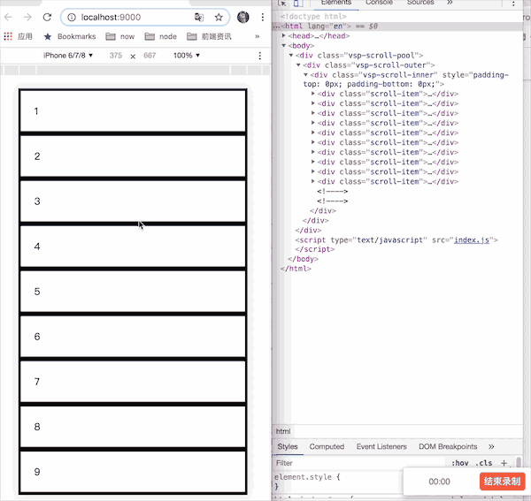

# vue scroll pool

## 效果



## 描述
`vue-scroll-pool` 是一个**滚动加载组件**，模仿自微博移动端web版，它的特点是：
1. 基于分页：每次滚动加载都是新增一页内容；
2. 渲染的元素数量固定：无论加载多少页的列表元素，浏览器只渲染两页的内容；


## 安装（install）

```shell

npm i vue-scroll-pool --save

```


## 使用（how to use）

```html
<vue-scroll-pool :get-data="makeList" :max-height="20000">
    <div slot="list-item" slot-scope="slotProps" class="item">
        {{slotProps.item}}
    </div>
</vue-scroll-pool>
```
## props

| prop 名称 | 类型 | 描述 | 默认值 |
|----------|------|-----|-------|
| outerHeight | String | 指定定容器元素的高度，支持'%'、'px'，例如：100% 或者 300px | 页面高度 |
| maxHeight | Number | 指定滚动的内容的最大高度 | Number.POSITIVE_INFINITY |
| getData | Function | 获取列表内容，改函数接收“当前的页码”作为参数，并返回一个 `Promise` 对象 | 无 |

## slot
| 名称 | 描述 | slot-scope |
|----------|------|-----|
| list-item | 指定列表项的内容 | `item` |
| loading | 指定加载数据时显示的内容，该元素在列表底部 | 无 |
| footer | 指定也列表加载完时显示的内容，该元素在列表底部 | 无 |
